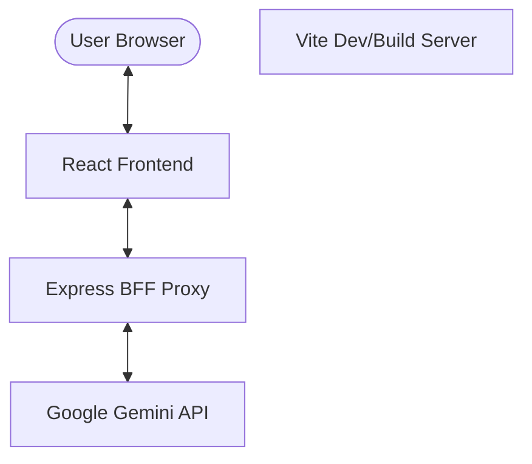

# System Architecture

The Enterprise Prompt Engineering Portal 2025 is built as a modern React application with an Express-based Backend-for-Frontend (BFF) proxy to ensure secure and efficient interaction with AI services.

## Architecture Overview

### 1. Frontend (React + Vite)
- **Framework**: React 19 with TypeScript.
- **Styling**: Tailwind CSS for a modern, responsive UI.
- **Visualization**: Recharts for interactive model benchmarking.
- **State Management**: React Hooks (useState, useMemo, useCallback).
- **Icons**: Lucide React.

### 2. Backend-for-Frontend (BFF) Proxy
The BFF proxy serves several critical roles:
- **Security**: Keeps the `GEMINI_API_KEY` on the server side, preventing exposure in the client-side bundle.
- **Rate Limiting**: Uses `express-rate-limit` to protect the API from abuse.
- **Sanitization**: Implements server-side input sanitization to detect and mitigate prompt injection attempts.
- **CORS**: Handles Cross-Origin Resource Sharing safely.

### 3. API Integration
- **Service**: Google Gemini 2.0 Flash.
- **SDK**: `@google/generative-ai`.
- **Functionality**: Handles real-time prompt refinement and structured output generation.

## Data Flow: Prompt Refinement

1.  **Input**: User enters a prompt in the Refinement UI.
2.  **Sanitization (Client)**: The frontend performs basic sanitization.
3.  **Request**: Frontend sends a POST request to `/api/refine`.
4.  **Middleware**:
    -   Rate limiter checks IP quota.
    -   Express parses the JSON body.
5.  **Sanitization (Server)**: BFF performs deep sanitization and injection pattern detection.
6.  **AI Processing**: BFF calls Gemini API with a system-instruction-enhanced prompt.
7.  **Response**: Refined prompt is returned to the frontend and displayed to the user.

## Environment Variables

- `GEMINI_API_KEY`: Required on the server side to authenticate with Google AI Studio.
- `PORT`: (Optional) Port for the BFF server (default: 3001).
- `VITE_API_URL`: (Optional) URL for the BFF API in production.

## Build and Deployment

- **Build Tool**: Vite 6.3.
- **Transpilation**: SWC (Speedy Web Compiler) for fast React transformations.
- **Production Artifact**: Static files in `dist/` and a Node.js server for the BFF.
