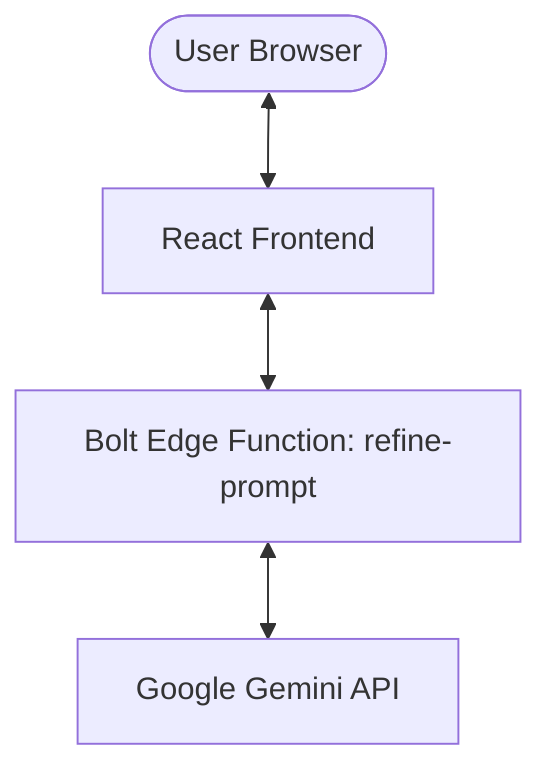

# System Architecture

The Enterprise Prompt Engineering Portal 2025 is built as a modern React application powered by a Bolt Database Edge Function (`refine-prompt`) for secure interaction with Google Gemini services.

## Architecture Overview

```mermaid
graph TD
    User([User Browser])
    ReactApp[React Frontend]
    EdgeFunc[Bolt Edge Function: refine-prompt]
    Gemini[Google Gemini API]

    User <--> ReactApp
    ReactApp <--> EdgeFunc
    EdgeFunc <--> Gemini
```

### 1. Frontend (React + Vite)
- **Framework**: React 19 with TypeScript.
- **Styling**: Tailwind CSS for a modern, responsive UI.
- **Visualization**: Recharts for interactive model benchmarking.
- **State Management**: React Hooks (useState, useMemo, useEffect).
- **Icons**: Lucide React.

### 2. Edge Function (`refine-prompt`)
The Bolt Database Edge Function serves critical operational roles:
- **Security Boundary**: Keeps `GEMINI_API_KEY` on the server side, preventing exposure in client-side bundles.
- **Sanitization & Guardrails**: Sanitizes input prompts and redacts prompt injection attempts before calling LLM APIs.
- **Input Validation & JSON Output**: Enforces POST requests, validates required fields, and returns structured JSON responses.
- **CORS Handling**: Implements clean CORS response headers for authorized client access.

### 3. API Integration
- **Service**: Google Gemini 2.0 Flash.
- **Functionality**: Handles real-time prompt refinement and structured output generation server-side.

## Data Flow: Prompt Refinement

1.  **Input**: User enters a prompt in the Refinement UI.
2.  **Sanitization (Client)**: Client sanitizes control characters and injection patterns.
3.  **Request**: Frontend sends a POST request to `https://refine-prompt.supabase.co/functions/v1/refine-prompt`.
4.  **Edge Function Execution**:
    -   Validates HTTP POST method.
    -   Reads server-only secret `GEMINI_API_KEY`.
    -   Validates body parameter `prompt`.
    -   Applies server-side sanitization.
    -   Invokes Gemini 2.0 Flash API.
5.  **Response**: Edge Function returns `{ "text": "..." }` or structured error JSON back to client.

## Environment Variables & Secrets

- `GEMINI_API_KEY`: Server-side secret set in the Bolt Edge Function environment only.
